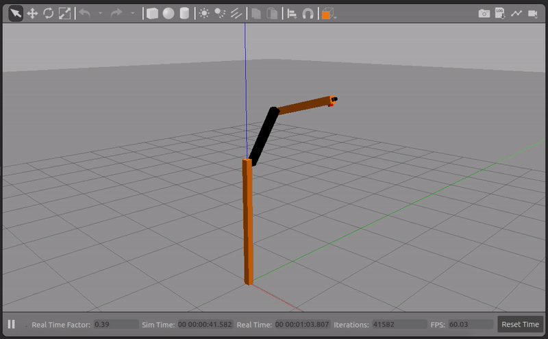
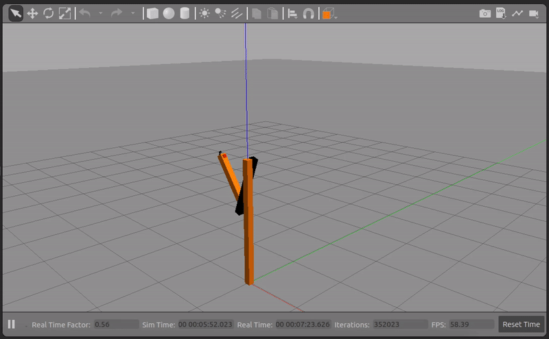

# Project-Based Learning for Robot Control Theory: A Robot Operating System (ROS) Based Approach

This is the accompanying git repository for our paper: <br>

**Project-Based Learning for Robot Control Theory: A Robot Operating System (ROS) Based Approach**<br>
[Siavash Farzan](https://sfarzan.com/)<br>
2023 ASEE Annual Conference & Exposition, American Society for Engineering Education, Jun. 2023

[[arXiv](https://arxiv.org/abs/2305.11279)] [[bibtex](https://sfarzan.com/data/sfarzan-asee2023.bib)]


## Example Demos

<p align="center">


</p>

## Citation
If you find this repository/paper useful, please cite our paper:

```
@inproceedings{asee_farzan_2023
  author = "Siavash Farzan"
  title = "Project-Based Learning for Robot Control Theory: A Robot Operating System (ROS) Based Approach"
  booktitle = "2023 ASEE Annual Conference \& Exposition"
  year = "2023"
  month = "June"
  address = "Baltimore, MD"
  publisher = "ASEE Conferences"
}
```
